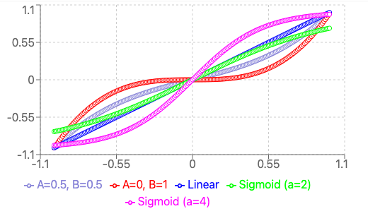

# Buttons - Controller Input Abstraction

Unified controller input abstraction supporting Xbox, PS5, and joystick controllers with flexible input processing and rumble feedback.

---

## Table of Contents

- [Overview](#overview)
- [Quick Start](#quick-start)
- [Controller Types](#controller-types)
- [Initialization](#initialization)
- [Input Processing](#input-processing)
- [Triggers](#triggers)
- [Rumble Feedback](#rumble-feedback)
- [Drive Input Suppliers](#drive-input-suppliers)
- [Complete Examples](#complete-examples)
- [API Reference](#api-reference)
- [Best Practices](#best-practices)
- [Troubleshooting](#troubleshooting)

---

## Overview

The `Buttons` utility class provides a centralized, type-safe way to handle controller inputs in FRC robot code. It eliminates the need to manage controller objects throughout your codebase and provides advanced input processing features.

### Key Features

- **Multi-Controller Support**: Xbox, PlayStation 5, and Logitech Extreme 3D Pro
- **Configurable Controller Types**: Set driver and operator controller types at initialization
- **Input Curves**: Linear, cubic, and sigmoid response curves for smoother control
- **Deadzone Management**: Automatic deadzone application with configurable thresholds
- **Trigger Abstraction**: All buttons and stick directions as WPILib `Trigger` objects
- **Rumble Feedback**: Thread-safe rumble with automatic shutoff
- **Drive Suppliers**: Pre-built `DoubleSupplier` factories for swerve/tank drive

### When to Use

✅ **Use Buttons when:**
- You need consistent controller input handling across your robot
- You want to support multiple controller types (Xbox, PS5, joystick)
- You need advanced input processing (curves, deadzones)
- You want centralized trigger definitions for command binding
- You need rumble feedback capabilities

❌ **Don't use Buttons when:**
- You have very simple, one-off controller needs
- You need custom controller types not supported
- You prefer managing controller objects directly

---

## Quick Start

### 1. Initialize in Robot.java

```java
public class Robot extends TimedRobot {
    @Override
    public void robotInit() {
        // Initialize with Xbox driver and PS5 operator
        Buttons.init(0, 1, ControllerType.XBOX, ControllerType.PS5);

        // Continue with rest of initialization
        m_robotContainer = new RobotContainer();
    }
}
```

### 2. Use Triggers in RobotContainer

```java
public class RobotContainer {
    private final SwerveSubsystem swerve = new SwerveSubsystem();

    public RobotContainer() {
        configureBindings();
    }

    private void configureBindings() {
        // Bind Xbox A button to intake command
        Buttons.XboxA.onTrue(intake.deployCommand());

        // Bind PS5 Square to shooter command
        Buttons.PS5Square.onTrue(shooter.spinUpCommand());

        // Set default drive command with cubic curves
        swerve.setDefaultCommand(
            swerve.driveCommand(
                Buttons.createForwardSupplier(0.05, InputCurve.CUBIC),
                Buttons.createStrafeSupplier(0.05, InputCurve.CUBIC),
                Buttons.createRotationSupplier(0.1, InputCurve.SIGMOID)
            )
        );
    }
}
```

---

## Controller Types

### Supported Controllers

```java
public enum ControllerType {
    XBOX,              // Xbox One/Series controller
    PS5,               // PlayStation 5 DualSense controller
    EXTREME_3D_PRO,    // Logitech Extreme 3D Pro joystick
    NONE               // No controller (disables triggers)
}
```

### Controller Comparison

| Feature | Xbox | PS5 | Extreme 3D Pro |
|---------|------|-----|----------------|
| Buttons | 10 | 14 | 12 |
| Analog Sticks | 2 | 2 | 1 |
| D-Pad | ✓ | ✓ | ✓ (POV) |
| Triggers | 2 analog | 2 analog | 1 analog |
| Rumble | ✓ | ✓ | ✗ |
| Touchpad | ✗ | ✓ | ✗ |

---

## Initialization

### Basic Initialization

```java
// Both Xbox controllers
Buttons.init(0, 1, ControllerType.XBOX, ControllerType.XBOX);
```

### Mixed Controller Types

```java
// Xbox driver, PS5 operator
Buttons.init(0, 1, ControllerType.XBOX, ControllerType.PS5);

// Xbox driver, joystick operator
Buttons.init(0, 1, ControllerType.XBOX, ControllerType.EXTREME_3D_PRO);

// PS5 driver, Xbox operator
Buttons.init(0, 1, ControllerType.PS5, ControllerType.XBOX);
```

### Single Controller (Driver Only)

```java
// Driver on Xbox, no operator controller
Buttons.init(0, -1, ControllerType.XBOX, ControllerType.NONE);
```

### Getting Controller References

```java
// Get typed controller references
CommandXboxController xbox = Buttons.getXboxController();
CommandPS5Controller ps5 = Buttons.getPS5Controller();
CommandJoystick joystick = Buttons.getJoystick();

// Get generic controller references
Object driver = Buttons.getDriverController();
Object operator = Buttons.getOperatorController();

// Check controller types
ControllerType driverType = Buttons.getDriverType();
ControllerType operatorType = Buttons.getOperatorType();
```

---

## Input Processing

### Deadzone Application

Deadzones eliminate stick drift and provide a clean zero point.

```java
// Apply deadzone to raw input
double rawX = controller.getLeftX();
double processedX = Buttons.applyDeadzone(rawX, 0.05);  // 5% deadzone
```

**Default Thresholds:**
- `DEFAULT_TRIGGER_THRESHOLD = 0.3` (30%)
- `DEFAULT_STICK_THRESHOLD = 0.8` (80%)

### Input Curves

Input curves change the relationship between stick position and output value, allowing finer control at low speeds.

```java
public enum InputCurve {
    LINEAR,    // 1:1 response (y = x)
    CUBIC,     // Cubic response (y = 0.1x + 0.9x³)
    SIGMOID    // S-curve response (smooth acceleration)
}
```

#### Curve Comparison



The graph above shows different input response curves:
- **Blue (Linear)** - Direct 1:1 mapping, 50% stick = 50% output
- **Red (A=0, B=1)** - Pure cubic curve (x³), extreme low-speed smoothing
- **Purple (A=0.5, B=0.5)** - Balanced mix of linear and cubic
- **Our Cubic (0.1x + 0.9x³)** - Similar to red, mostly cubic with slight linear component
- **Green (Sigmoid a=2)** - S-curve used in our implementation
- **Magenta (Sigmoid a=4)** - More aggressive S-curve

#### Linear Curve - `InputCurve.LINEAR`

**Formula:** `y = x`

**Characteristics:**
- Direct 1:1 response at all speeds
- 50% stick position = 50% output
- Maximum precision and responsiveness
- No smoothing applied

**Best for:** Precise control, experienced drivers

**Example:**
```java
Buttons.createForwardSupplier(0.05, InputCurve.LINEAR)
```

---

#### Cubic Curve - `InputCurve.CUBIC`

**Formula:** `y = 0.1x + 0.9x³`

**Characteristics:**
- Finer control at low speeds (e.g., 30% stick ≈ 10% output)
- Still reaches 100% at full stick deflection
- Smooth transition from low to high speed
- **Recommended for general driving**

**Best for:** General driving, smoother low-speed control (default recommendation)

**Example:**
```java
Buttons.createForwardSupplier(0.05, InputCurve.CUBIC)
```

**Why 0.1 linear + 0.9 cubic?**
- The small linear component (10%) prevents output from being zero at very low stick positions
- The large cubic component (90%) provides the smoothing effect
- This combination gives fine control while maintaining responsiveness

---

#### Sigmoid Curve - `InputCurve.SIGMOID`

**Formula:** S-curve with steepness parameter = 2.0

**Characteristics:**
- Very gradual acceleration from zero
- Steep middle section for rapid response
- Gradual approach to maximum
- Creates an "S" shape (see green curve in graph)
- **Excellent for preventing over-rotation**

**Best for:** Rotation control, preventing over-rotation, mechanisms needing smooth acceleration

**Example:**
```java
Buttons.createRotationSupplier(0.1, InputCurve.SIGMOID)
```

**Why sigmoid for rotation?**
- Prevents sudden spinning movements
- Makes it easier to aim precisely
- Reduces overshooting when trying to face a target
- Feels more natural for human control

### Comprehensive Input Processing

Combine deadzone and curve in one call:

```java
// Process with deadzone + cubic curve
double forward = Buttons.processInput(rawInput, 0.05, InputCurve.CUBIC);

// Process with deadzone + sigmoid curve for rotation
double rotation = Buttons.processInput(rawRotation, 0.1, InputCurve.SIGMOID);

// Linear (no curve) with deadzone
double strafe = Buttons.processInput(rawStrafe, 0.05, InputCurve.LINEAR);
```

**Processing Order:**
1. Apply deadzone first
2. If input is zero after deadzone, return 0.0
3. Apply selected curve to non-zero values

---

## Triggers

All controller buttons and stick directions are exposed as WPILib `Trigger` objects for easy command binding.

### Xbox Controller Triggers

#### Buttons
```java
Buttons.XboxA           // A button (green)
Buttons.XboxB           // B button (red)
Buttons.XboxX           // X button (blue)
Buttons.XboxY           // Y button (yellow)
Buttons.XboxLeftBumper  // Left bumper (LB)
Buttons.XboxRightBumper // Right bumper (RB)
Buttons.XboxBack        // Back button
Buttons.XboxStart       // Start button
Buttons.XboxLeftStick   // Left stick press (L3)
Buttons.XboxRightStick  // Right stick press (R3)
```

#### Triggers (Analog)
```java
Buttons.XboxLeftTriggerButton   // Left trigger (LT) > 30%
Buttons.XboxRightTriggerButton  // Right trigger (RT) > 30%
```

#### Stick Directions
```java
Buttons.XboxRightStickUp     // Right stick pushed up > 80%
Buttons.XboxRightStickDown   // Right stick pushed down > 80%
Buttons.XboxLeftStickUp      // Left stick pushed up > 80%
Buttons.XboxLeftStickDown    // Left stick pushed down > 80%
```

#### D-Pad
```java
Buttons.XboxPOVUp       // D-pad up
Buttons.XboxPOVDown     // D-pad down
Buttons.XboxPOVLeft     // D-pad left
Buttons.XboxPOVRight    // D-pad right
```

### PS5 Controller Triggers

#### Buttons
```java
Buttons.PS5Cross        // Cross button (✕)
Buttons.PS5Circle       // Circle button (○)
Buttons.PS5Square       // Square button (□)
Buttons.PS5Triangle     // Triangle button (△)
Buttons.PS5L1           // L1 bumper
Buttons.PS5R1           // R1 bumper
Buttons.PS5Create       // Create button
Buttons.PS5Options      // Options button
Buttons.PS5L3           // L3 (left stick press)
Buttons.PS5R3           // R3 (right stick press)
Buttons.PS5PS           // PlayStation button
Buttons.PS5Touchpad     // Touchpad press
```

#### Triggers (Analog)
```java
Buttons.PS5L2Button     // L2 trigger > 30%
Buttons.PS5R2Button     // R2 trigger > 30%
```

#### Stick Directions
```java
Buttons.PS5RightStickUp     // Right stick pushed up > 80%
Buttons.PS5RightStickDown   // Right stick pushed down > 80%
Buttons.PS5LeftStickUp      // Left stick pushed up > 80%
Buttons.PS5LeftStickDown    // Left stick pushed down > 80%
```

#### D-Pad
```java
Buttons.PS5DPadUp       // D-pad up
Buttons.PS5DPadDown     // D-pad down
Buttons.PS5DPadLeft     // D-pad left
Buttons.PS5DPadRight    // D-pad right
```

### Joystick Triggers

#### Buttons
```java
Buttons.JoystickTrigger     // Main trigger
Buttons.JoystickThumb       // Thumb button
Buttons.JoystickButton3     // Side button 3
Buttons.JoystickButton4     // Side button 4
Buttons.JoystickButton5     // Side button 5
Buttons.JoystickButton6     // Side button 6
Buttons.JoystickButton7     // Base button 7
Buttons.JoystickButton8     // Base button 8
Buttons.JoystickButton9     // Base button 9
Buttons.JoystickButton10    // Base button 10
Buttons.JoystickButton11    // Base button 11
Buttons.JoystickButton12    // Base button 12
```

#### POV (Hat Switch)
```java
Buttons.JoystickPOVUp       // POV up
Buttons.JoystickPOVDown     // POV down
Buttons.JoystickPOVLeft     // POV left
Buttons.JoystickPOVRight    // POV right
```

### Trigger Usage Examples

```java
// Simple button binding
Buttons.XboxA.onTrue(intake.deployCommand());
Buttons.XboxB.onTrue(intake.retractCommand());

// While held
Buttons.PS5Square.whileTrue(shooter.spinUpCommand());

// Toggle
Buttons.XboxLeftBumper.toggleOnTrue(climber.deployCommand());

// Combine triggers
Buttons.XboxRightBumper.and(Buttons.XboxA).onTrue(specialCommand());

// Negate trigger
Buttons.XboxLeftTriggerButton.negate().onTrue(defaultStateCommand());
```

---

## Rumble Feedback

Provide haptic feedback to the driver/operator.

### Xbox Rumble

```java
// Rumble for 500ms at 70% intensity
Buttons.rumbleXbox(Buttons.getXboxController(), 500, 0.7);

// Rumble for 1 second at 100% intensity
Buttons.rumbleXbox(Buttons.getXboxController(), 1000, 1.0);

// Stop rumble immediately
Buttons.stopRumbleXbox(Buttons.getXboxController());
```

### PS5 Rumble

```java
// Rumble for 500ms at 70% intensity
Buttons.rumblePS5(Buttons.getPS5Controller(), 500, 0.7);

// Stop rumble immediately
Buttons.stopRumblePS5(Buttons.getPS5Controller());
```

### Rumble in Commands

```java
public class IntakeCommand extends Command {
    public IntakeCommand() {
        // ...
    }

    @Override
    public void end(boolean interrupted) {
        // Rumble when game piece acquired
        if (!interrupted && hasPiece()) {
            Buttons.rumbleXbox(Buttons.getXboxController(), 300, 0.5);
        }
    }
}
```

### Rumble Parameters

- **Duration**: 0 to 5000 milliseconds (clamped automatically)
- **Intensity**: 0.0 to 1.0 (0% to 100%, clamped automatically)

**Implementation Details:**
- Uses `ScheduledExecutorService` for automatic shutoff
- Cancels previous rumble before starting new one
- Thread-safe for concurrent use
- No busy-wait loops (efficient)

---

## Drive Input Suppliers

Pre-built `DoubleSupplier` factories for swerve and tank drive systems.

### Swerve Drive Suppliers

```java
public RobotContainer() {
    // Create suppliers with deadzone and curves
    DoubleSupplier forward = Buttons.createForwardSupplier(0.05, InputCurve.CUBIC);
    DoubleSupplier strafe = Buttons.createStrafeSupplier(0.05, InputCurve.CUBIC);
    DoubleSupplier rotation = Buttons.createRotationSupplier(0.1, InputCurve.SIGMOID);

    // Set default swerve drive command
    swerve.setDefaultCommand(
        swerve.driveCommand(forward, strafe, rotation)
    );
}
```

### Tank Drive Suppliers

```java
public RobotContainer() {
    // Create suppliers for tank drive
    DoubleSupplier leftSpeed = Buttons.createForwardSupplier(0.05, InputCurve.CUBIC);
    DoubleSupplier rightSpeed = Buttons.createStrafeSupplier(0.05, InputCurve.CUBIC);

    // Set default tank drive command
    drivetrain.setDefaultCommand(
        new TankDriveCommand(drivetrain, leftSpeed, rightSpeed)
    );
}
```

### Controller-Specific Behavior

The suppliers automatically adapt to the selected controller type:

| Supplier | Xbox | PS5 | Extreme 3D Pro |
|----------|------|-----|----------------|
| Forward | Left Y | Left Y | Y axis |
| Strafe | Left X | Left X | X axis |
| Rotation | Right X | Right X | Twist/Z axis |

### Custom Processing

For custom input processing, use `processInput()`:

```java
DoubleSupplier customForward = () -> {
    CommandXboxController xbox = Buttons.getXboxController();
    double raw = xbox.getLeftY();
    return Buttons.processInput(raw, 0.08, InputCurve.SIGMOID);
};
```

---

## Complete Examples

### Example 1: Robot.java Initialization

```java
package frc.robot;

import edu.wpi.first.wpilibj.TimedRobot;
import edu.wpi.first.wpilibj2.command.Command;
import edu.wpi.first.wpilibj2.command.CommandScheduler;
import com.adambots.lib.utils.Buttons;
import com.adambots.lib.utils.Buttons.ControllerType;

public class Robot extends TimedRobot {
    private Command m_autonomousCommand;
    private RobotContainer m_robotContainer;

    @Override
    public void robotInit() {
        // Initialize Buttons FIRST - before RobotContainer
        // This ensures triggers are ready for command binding
        Buttons.init(0, 1, ControllerType.XBOX, ControllerType.PS5);

        // Now create RobotContainer (which uses Buttons triggers)
        m_robotContainer = new RobotContainer();
    }

    @Override
    public void robotPeriodic() {
        CommandScheduler.getInstance().run();
    }

    @Override
    public void autonomousInit() {
        m_autonomousCommand = m_robotContainer.getAutonomousCommand();
        if (m_autonomousCommand != null) {
            m_autonomousCommand.schedule();
        }
    }

    @Override
    public void teleopInit() {
        if (m_autonomousCommand != null) {
            m_autonomousCommand.cancel();
        }
    }
}
```

### Example 2: RobotContainer - Basic Setup

```java
package frc.robot;

import edu.wpi.first.wpilibj2.command.Command;
import com.adambots.lib.utils.Buttons;
import com.adambots.lib.utils.Buttons.InputCurve;
import frc.robot.subsystems.*;

public class RobotContainer {
    // Subsystems
    private final SwerveSubsystem swerve = new SwerveSubsystem();
    private final IntakeSubsystem intake = new IntakeSubsystem();
    private final ShooterSubsystem shooter = new ShooterSubsystem();

    public RobotContainer() {
        configureDefaultCommands();
        configureBindings();
    }

    private void configureDefaultCommands() {
        // Swerve drive with cubic curves for smooth control
        swerve.setDefaultCommand(
            swerve.driveCommand(
                Buttons.createForwardSupplier(0.05, InputCurve.CUBIC),
                Buttons.createStrafeSupplier(0.05, InputCurve.CUBIC),
                Buttons.createRotationSupplier(0.1, InputCurve.SIGMOID)
            )
        );
    }

    private void configureBindings() {
        // Driver (Xbox) - Intake controls
        Buttons.XboxA.onTrue(intake.deployCommand());
        Buttons.XboxB.onTrue(intake.retractCommand());
        Buttons.XboxX.whileTrue(intake.intakeCommand());
        Buttons.XboxY.whileTrue(intake.ejectCommand());

        // Driver (Xbox) - Speed control
        Buttons.XboxLeftBumper.onTrue(swerve.setSlowModeCommand(true));
        Buttons.XboxLeftBumper.onFalse(swerve.setSlowModeCommand(false));

        // Operator (PS5) - Shooter controls
        Buttons.PS5Square.whileTrue(shooter.spinUpCommand());
        Buttons.PS5Circle.onTrue(shooter.shootCommand());
        Buttons.PS5Triangle.onTrue(shooter.stopCommand());
    }

    public Command getAutonomousCommand() {
        return swerve.getAutonomousCommand("TestPath");
    }
}
```

### Example 3: RobotContainer - Advanced Setup

```java
package frc.robot;

import edu.wpi.first.wpilibj2.command.Command;
import edu.wpi.first.wpilibj2.command.Commands;
import com.adambots.lib.utils.Buttons;
import com.adambots.lib.utils.Buttons.InputCurve;
import frc.robot.subsystems.*;

public class RobotContainer {
    // Subsystems
    private final SwerveSubsystem swerve = new SwerveSubsystem();
    private final IntakeSubsystem intake = new IntakeSubsystem();
    private final ShooterSubsystem shooter = new ShooterSubsystem();
    private final ClimberSubsystem climber = new ClimberSubsystem();

    public RobotContainer() {
        configureDefaultCommands();
        configureDriverBindings();
        configureOperatorBindings();
        configureComboBindings();
    }

    private void configureDefaultCommands() {
        // Swerve with field-oriented drive
        swerve.setDefaultCommand(
            swerve.driveCommand(
                Buttons.createForwardSupplier(0.05, InputCurve.CUBIC),
                Buttons.createStrafeSupplier(0.05, InputCurve.CUBIC),
                Buttons.createRotationSupplier(0.1, InputCurve.SIGMOID)
            )
        );
    }

    private void configureDriverBindings() {
        // A - Deploy intake
        Buttons.XboxA.onTrue(
            intake.deployCommand()
                .andThen(Commands.runOnce(() ->
                    Buttons.rumbleXbox(Buttons.getXboxController(), 200, 0.5)
                ))
        );

        // B - Retract intake
        Buttons.XboxB.onTrue(intake.retractCommand());

        // X - Intake while held
        Buttons.XboxX.whileTrue(intake.intakeCommand());

        // Y - Eject
        Buttons.XboxY.whileTrue(intake.ejectCommand());

        // Left bumper - Slow mode
        Buttons.XboxLeftBumper.whileTrue(swerve.setMaxSpeedCommand(0.3));

        // Right bumper - Turbo mode
        Buttons.XboxRightBumper.whileTrue(swerve.setMaxSpeedCommand(1.0));

        // Back button - Reset gyro
        Buttons.XboxBack.onTrue(swerve.resetGyroCommand());

        // Start button - Lock wheels
        Buttons.XboxStart.whileTrue(swerve.lockWheelsCommand());

        // Left trigger - Auto-align to AprilTag
        Buttons.XboxLeftTriggerButton.whileTrue(
            swerve.aimAtAprilTagCommand(4, 2.0)
        );

        // Right trigger - Auto-aim at target
        Buttons.XboxRightTriggerButton.whileTrue(
            swerve.aimAtTargetCommand(Cameras.SHOOTER_CAM)
        );

        // D-Pad - Drive to preset positions
        Buttons.XboxPOVUp.onTrue(swerve.driveToPoseCommand(FieldPositions.AMP));
        Buttons.XboxPOVRight.onTrue(swerve.driveToPoseCommand(FieldPositions.SOURCE));
        Buttons.XboxPOVDown.onTrue(swerve.driveToPoseCommand(FieldPositions.SPEAKER));
    }

    private void configureOperatorBindings() {
        // PS5 Square - Spin up shooter
        Buttons.PS5Square.whileTrue(shooter.spinUpCommand());

        // PS5 Circle - Shoot
        Buttons.PS5Circle.onTrue(
            Commands.sequence(
                shooter.shootCommand(),
                Commands.runOnce(() ->
                    Buttons.rumblePS5(Buttons.getPS5Controller(), 300, 0.7)
                )
            )
        );

        // PS5 Triangle - Stop shooter
        Buttons.PS5Triangle.onTrue(shooter.stopCommand());

        // PS5 Cross - Feed to shooter
        Buttons.PS5Cross.whileTrue(intake.feedToShooterCommand());

        // PS5 L1 - Climber down
        Buttons.PS5L1.whileTrue(climber.extendCommand());

        // PS5 R1 - Climber up
        Buttons.PS5R1.whileTrue(climber.retractCommand());

        // PS5 L2 - Manual climber control (left)
        Buttons.PS5L2Button.whileTrue(climber.manualLeftCommand(
            () -> Buttons.getPS5Controller().getL2Axis()
        ));

        // PS5 R2 - Manual climber control (right)
        Buttons.PS5R2Button.whileTrue(climber.manualRightCommand(
            () -> Buttons.getPS5Controller().getR2Axis()
        ));

        // PS5 Options - Emergency stop all
        Buttons.PS5Options.onTrue(
            Commands.parallel(
                shooter.stopCommand(),
                intake.stopCommand(),
                climber.stopCommand()
            ).withTimeout(0.1)
        );
    }

    private void configureComboBindings() {
        // Driver + Operator combo: Climb sequence
        // Xbox Start + PS5 Triangle = Deploy climber
        Buttons.XboxStart.and(Buttons.PS5Triangle)
            .onTrue(climber.deploySequenceCommand());

        // Xbox Back + PS5 Circle = Retract climber
        Buttons.XboxBack.and(Buttons.PS5Circle)
            .onTrue(climber.retractSequenceCommand());
    }

    public Command getAutonomousCommand() {
        return swerve.getAutonomousCommand("TestPath");
    }
}
```

### Example 4: Mixed Controller Types

```java
public class Robot extends TimedRobot {
    @Override
    public void robotInit() {
        // Driver uses joystick, operator uses Xbox
        Buttons.init(0, 1, ControllerType.EXTREME_3D_PRO, ControllerType.XBOX);

        m_robotContainer = new RobotContainer();
    }
}

public class RobotContainer {
    private void configureBindings() {
        // Driver on joystick
        Buttons.JoystickTrigger.whileTrue(intake.intakeCommand());
        Buttons.JoystickThumb.onTrue(intake.deployCommand());
        Buttons.JoystickButton3.onTrue(shooter.shootCommand());

        // Operator on Xbox
        Buttons.XboxA.whileTrue(climber.extendCommand());
        Buttons.XboxB.whileTrue(climber.retractCommand());
    }

    private void configureDefaultCommands() {
        // Tank drive with joystick Y/X for left and twist for right
        // (requires custom implementation)
        drivetrain.setDefaultCommand(
            new TankDriveCommand(
                drivetrain,
                Buttons.createForwardSupplier(0.05, InputCurve.CUBIC),  // Left side
                () -> {
                    double twist = Buttons.getJoystick().getTwist();
                    return Buttons.processInput(twist, 0.05, InputCurve.CUBIC);  // Right side
                }
            )
        );
    }
}
```

---

## API Reference

### Initialization

```java
public static void init(int driverPort, int operatorPort,
                       ControllerType driverControllerType,
                       ControllerType operatorControllerType)
```
Initialize Buttons with controller ports and types. **Must be called in `Robot.robotInit()` before `RobotContainer` is created.**

**Parameters:**
- `driverPort` - USB port for driver controller (typically 0)
- `operatorPort` - USB port for operator controller (typically 1, use -1 for none)
- `driverControllerType` - Type of driver controller
- `operatorControllerType` - Type of operator controller

---

### Input Processing

```java
public static double applyDeadzone(double input, double deadzone)
```
Apply deadzone to raw input value.

**Returns:** 0.0 if within deadzone, scaled value otherwise

---

```java
public static double applyCubicCurve(double input)
```
Apply cubic response curve: `0.1 * input + 0.9 * input³`

---

```java
public static double applySigmoidCurve(double input)
```
Apply sigmoid (S-curve) response for smooth acceleration.

---

```java
public static double processInput(double rawInput, double deadzone, InputCurve curve)
```
Comprehensive input processing combining deadzone and curve.

**Parameters:**
- `rawInput` - Raw controller input (-1.0 to 1.0)
- `deadzone` - Deadzone threshold (0.0 to 1.0)
- `curve` - Input curve to apply

**Returns:** Processed input value

---

### Drive Suppliers

```java
public static DoubleSupplier createForwardSupplier(double deadzone, InputCurve curve)
```
Create forward/backward drive supplier (Y axis).

---

```java
public static DoubleSupplier createStrafeSupplier(double deadzone, InputCurve curve)
```
Create left/right strafe supplier (X axis).

---

```java
public static DoubleSupplier createRotationSupplier(double deadzone, InputCurve curve)
```
Create rotation supplier (X axis of right stick or twist).

---

### Rumble

```java
public static void rumbleXbox(CommandXboxController controller,
                              int durationMs, double intensity)
```
Rumble Xbox controller with automatic shutoff.

**Parameters:**
- `controller` - Xbox controller to rumble
- `durationMs` - Duration in milliseconds (0-5000, clamped)
- `intensity` - Rumble intensity (0.0-1.0, clamped)

---

```java
public static void rumblePS5(CommandPS5Controller controller,
                            int durationMs, double intensity)
```
Rumble PS5 controller with automatic shutoff.

---

```java
public static void stopRumbleXbox(CommandXboxController controller)
```
Immediately stop Xbox controller rumble.

---

```java
public static void stopRumblePS5(CommandPS5Controller controller)
```
Immediately stop PS5 controller rumble.

---

### Controller Getters

```java
public static CommandXboxController getXboxController()
```
Get Xbox controller instance. Returns driver if Xbox, otherwise operator.

**Throws:** IllegalStateException if no Xbox controller configured

---

```java
public static CommandPS5Controller getPS5Controller()
```
Get PS5 controller instance. Returns driver if PS5, otherwise operator.

**Throws:** IllegalStateException if no PS5 controller configured

---

```java
public static CommandJoystick getJoystick()
```
Get joystick instance. Returns driver if joystick, otherwise operator.

**Throws:** IllegalStateException if no joystick configured

---

```java
public static Object getDriverController()
public static Object getOperatorController()
public static ControllerType getDriverType()
public static ControllerType getOperatorType()
```
Get controller references and types.

---

## Best Practices

### 1. Initialize Early in Robot.robotInit()

```java
// ✓ CORRECT - Initialize before RobotContainer
public void robotInit() {
    Buttons.init(0, 1, ControllerType.XBOX, ControllerType.PS5);
    m_robotContainer = new RobotContainer();
}

// ✗ WRONG - RobotContainer uses Buttons triggers
public void robotInit() {
    m_robotContainer = new RobotContainer();  // Triggers not ready!
    Buttons.init(0, 1, ControllerType.XBOX, ControllerType.PS5);
}
```

### 2. Use Appropriate Input Curves

```java
// ✓ GOOD - Cubic for translation, sigmoid for rotation
DoubleSupplier forward = Buttons.createForwardSupplier(0.05, InputCurve.CUBIC);
DoubleSupplier rotation = Buttons.createRotationSupplier(0.1, InputCurve.SIGMOID);

// ✓ ACCEPTABLE - Linear for precise control (skilled drivers)
DoubleSupplier strafe = Buttons.createStrafeSupplier(0.05, InputCurve.LINEAR);

// ⚠ CAUTION - Sigmoid for translation can feel sluggish
DoubleSupplier forward = Buttons.createForwardSupplier(0.05, InputCurve.SIGMOID);
```

### 3. Set Appropriate Deadzones

```java
// ✓ GOOD - Small deadzone for new controllers
DoubleSupplier forward = Buttons.createForwardSupplier(0.05, InputCurve.CUBIC);

// ✓ GOOD - Larger deadzone for worn controllers
DoubleSupplier forward = Buttons.createForwardSupplier(0.1, InputCurve.CUBIC);

// ✗ TOO SMALL - Will drift on most controllers
DoubleSupplier forward = Buttons.createForwardSupplier(0.01, InputCurve.CUBIC);

// ✗ TOO LARGE - Hard to start moving
DoubleSupplier forward = Buttons.createForwardSupplier(0.3, InputCurve.CUBIC);
```

### 4. Use Rumble Sparingly

```java
// ✓ GOOD - Short rumble for important events
Buttons.XboxA.onTrue(
    intake.deployCommand()
        .andThen(Commands.runOnce(() ->
            Buttons.rumbleXbox(Buttons.getXboxController(), 200, 0.5)
        ))
);

// ✗ ANNOYING - Rumble on every button press
Buttons.XboxA.onTrue(
    Commands.runOnce(() -> Buttons.rumbleXbox(Buttons.getXboxController(), 1000, 1.0))
);
```

### 5. Group Related Bindings

```java
// ✓ GOOD - Organized by subsystem
private void configureIntakeBindings() {
    Buttons.XboxA.onTrue(intake.deployCommand());
    Buttons.XboxB.onTrue(intake.retractCommand());
    Buttons.XboxX.whileTrue(intake.intakeCommand());
}

private void configureShooterBindings() {
    Buttons.PS5Square.whileTrue(shooter.spinUpCommand());
    Buttons.PS5Circle.onTrue(shooter.shootCommand());
}
```

### 6. Use Meaningful Trigger Combinations

```java
// ✓ GOOD - Combo for safety-critical operations
Buttons.XboxStart.and(Buttons.XboxBack)
    .onTrue(climber.emergencyReleaseCommand());

// ✓ GOOD - Modifier button pattern
Buttons.XboxLeftBumper.and(Buttons.XboxA)
    .onTrue(intake.advancedModeCommand());
```

### 7. Consider Controller Ergonomics

**Xbox Layout:**
- A/B/X/Y: Frequent actions (intake, eject)
- Bumpers: Modifiers or toggles
- Triggers: Continuous actions (auto-aim)
- D-Pad: Presets or navigation
- Back/Start: System functions (reset, lock)

**PS5 Layout:**
- Cross/Circle/Square/Triangle: Primary actions
- L1/R1: Secondary actions
- L2/R2: Analog control or auto-aim
- D-Pad: Presets
- Create/Options: System functions

---

## Troubleshooting

### Problem: "Buttons not initialized" Exception

**Cause:** `Buttons.init()` not called before using triggers.

**Solution:**
```java
// Call init() in Robot.robotInit() BEFORE creating RobotContainer
public void robotInit() {
    Buttons.init(0, 1, ControllerType.XBOX, ControllerType.PS5);
    m_robotContainer = new RobotContainer();
}
```

---

### Problem: Controller Not Responding

**Diagnostics:**
```java
// Check if controller is connected
System.out.println("Driver type: " + Buttons.getDriverType());
System.out.println("Driver controller: " + Buttons.getDriverController());

// Test raw input
CommandXboxController xbox = Buttons.getXboxController();
System.out.println("Left Y: " + xbox.getLeftY());
```

**Common Causes:**
1. Wrong USB port number
2. Controller not connected
3. Controller type mismatch
4. Driver station not enabled

---

### Problem: Stick Drift (Robot Moves When Released)

**Solution:** Increase deadzone
```java
// Increase deadzone from 0.05 to 0.1 or higher
DoubleSupplier forward = Buttons.createForwardSupplier(0.1, InputCurve.CUBIC);
```

---

### Problem: Control Feels Too Sensitive

**Solution:** Use cubic or sigmoid curve
```java
// Change from LINEAR to CUBIC
DoubleSupplier forward = Buttons.createForwardSupplier(0.05, InputCurve.CUBIC);

// Or use SIGMOID for even smoother response
DoubleSupplier rotation = Buttons.createRotationSupplier(0.1, InputCurve.SIGMOID);
```

---

### Problem: Rumble Not Working

**Diagnostics:**
```java
// Test rumble directly
Buttons.rumbleXbox(Buttons.getXboxController(), 1000, 1.0);
```

**Common Causes:**
1. Controller doesn't support rumble (joystick)
2. USB cable doesn't support rumble (data-only cable)
3. Driver station disabled
4. Wrong controller type configured

---

### Problem: Wrong Controller Type

**Solution:** Check initialization
```java
// Verify controller types
System.out.println("Driver: " + Buttons.getDriverType());
System.out.println("Operator: " + Buttons.getOperatorType());

// Fix initialization if wrong
Buttons.init(0, 1, ControllerType.XBOX, ControllerType.PS5);  // Correct types
```

---

### Problem: Triggers Not Firing

**Diagnostics:**
```java
// Add debug output to verify trigger state
Buttons.XboxA.onTrue(
    Commands.runOnce(() -> System.out.println("Xbox A pressed!"))
);
```

**Common Causes:**
1. Command scheduler not running (`CommandScheduler.getInstance().run()` in `robotPeriodic()`)
2. Buttons not initialized
3. Wrong trigger for controller type (using Xbox triggers with PS5 controller)

---

## Migration from Direct Controller Usage

### Before (Direct Controller Management)

```java
public class RobotContainer {
    private final CommandXboxController driverController = new CommandXboxController(0);
    private final CommandPS5Controller operatorController = new CommandPS5Controller(1);

    private void configureBindings() {
        driverController.a().onTrue(intake.deployCommand());
        operatorController.square().whileTrue(shooter.spinUpCommand());
    }

    private void configureDefaultCommands() {
        swerve.setDefaultCommand(
            swerve.driveCommand(
                () -> applyDeadzone(driverController.getLeftY(), 0.05),
                () -> applyDeadzone(driverController.getLeftX(), 0.05),
                () -> applyDeadzone(driverController.getRightX(), 0.1)
            )
        );
    }

    private double applyDeadzone(double value, double deadzone) {
        return Math.abs(value) < deadzone ? 0.0 : value;
    }
}
```

### After (Using Buttons)

```java
public class RobotContainer {
    // No controller objects needed!

    private void configureBindings() {
        Buttons.XboxA.onTrue(intake.deployCommand());
        Buttons.PS5Square.whileTrue(shooter.spinUpCommand());
    }

    private void configureDefaultCommands() {
        swerve.setDefaultCommand(
            swerve.driveCommand(
                Buttons.createForwardSupplier(0.05, InputCurve.CUBIC),
                Buttons.createStrafeSupplier(0.05, InputCurve.CUBIC),
                Buttons.createRotationSupplier(0.1, InputCurve.SIGMOID)
            )
        );
    }

    // No helper methods needed!
}

// In Robot.java
public void robotInit() {
    Buttons.init(0, 1, ControllerType.XBOX, ControllerType.PS5);
    m_robotContainer = new RobotContainer();
}
```

**Benefits:**
- ✓ No controller objects in RobotContainer
- ✓ Built-in deadzone and curve processing
- ✓ Cleaner, more readable code
- ✓ Centralized controller management
- ✓ Easy to switch controller types

---

## See Also

- [StateMachine Documentation](StateMachine.md) - State machine utility for subsystems
- [Utils Documentation](README.md) - Overview of all utilities
- [WPILib Command-Based Programming](https://docs.wpilib.org/en/stable/docs/software/commandbased/index.html)
- [WPILib Trigger Documentation](https://docs.wpilib.org/en/stable/docs/software/commandbased/binding-commands-to-triggers.html)

---

**Last Updated:** 2026-01-14
